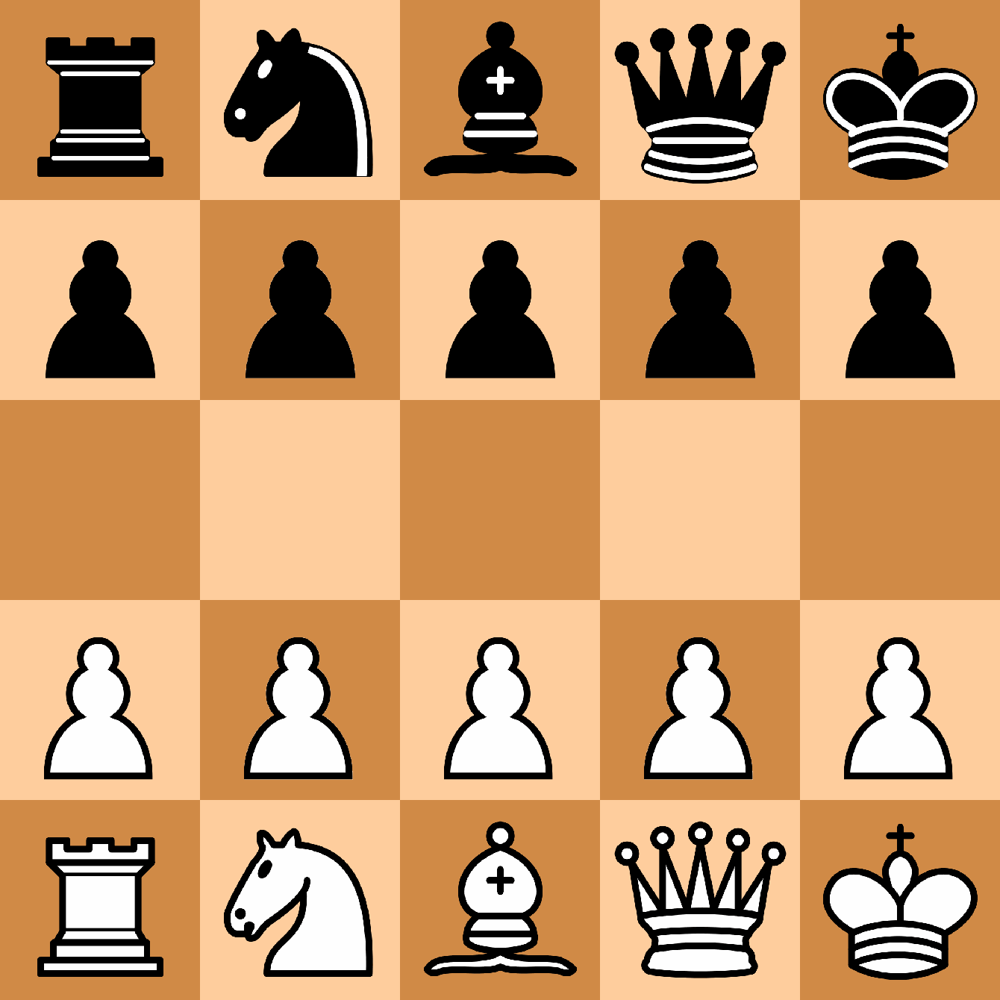

# ♟️ หมากรุกกับ AI: สร้าง Chess AI ด้วย Deep Q-Learning และ Pygame อย่างง่าย (แต่เท่!)

เคยสงสัยไหมว่า AI อย่าง AlphaZero เล่นหมากรุกเก่งได้ยังไง? วันนี้เราจะมาลองสร้าง AI หมากรุกด้วยตัวเองแบบง่ายๆ ด้วยภาษา Python และ Deep Q-Learning (DQN) กัน!

>หมายเหตุ โค้ดและเนื้อหาต่อไปนี้เป็นการสร้างขึ้นเองทั้งหมด ***(นาย จารุเดช เจตนา)***

---

## 🔍 โปรเจกต์นี้คืออะไร?

ในบทความนี้ เราจะพาคุณไปสร้าง **AI** ที่สามารถเล่น **หมากรุก** ได้ด้วยตัวเอง โดยใช้เทคนิคที่เรียกว่า **Deep Q-Learning** ซึ่งเป็นส่วนหนึ่งของ **Reinforcement Learning (RL)** หรือ "การเรียนรู้จากการลงมือทำและการรับผลลัพธ์" อธิบายง่ายๆ คือ AI จะเรียนรู้จากประสบการณ์การเล่นเกมของมันเอง และค่อยๆ พัฒนาความสามารถของมันให้ดีขึ้นไปเรื่อยๆ โดยไม่จำเป็นต้องมีข้อมูลจากภายนอกมากมาย

ลองนึกภาพว่าคุณเล่นหมากรุกครั้งแรก คุณอาจจะพลาดหลายครั้ง แต่หลังจากที่เล่นไปเรื่อยๆ คุณจะเริ่มเข้าใจและเก่งขึ้น AI ก็ทำแบบเดียวกันในการเรียนรู้จากการลองผิดลองถูกผ่านการเล่นหลายๆ ครั้ง

## 🧠 AI ตัวนี้คืออะไร? ทำงานยังไง?

AI ที่เรากำลังจะสร้างนั้นใช้ Deep Q-Learning (DQN) ซึ่งเป็นรูปแบบหนึ่งของ Reinforcement Learning (RL) ที่จะให้ AI ทำการทดลองเล่น และประเมินผลลัพธ์จากการกระทำของตัวเอง โดยเฉพาะในเกมที่ต้องใช้กลยุทธ์ซับซ้อน เช่น **หมากรุก**

### 🤖 แล้ว DQN คืออะไร?
ลองนึกภาพว่าคุณเล่นเกมโดยที่ไม่เคยมีใครสอน คุณลองกดปุ่มดูไปเรื่อยๆ แล้วจำไว้ว่ากดแบบไหนแล้วคะแนนขึ้น กดแบบไหนคะแนนลด AI ตัวนี้ก็ทำแบบนั้น! แต่แทนที่จะจำด้วยสมอง มันใช้ **Neural Network** เป็นตัวช่วยจำ

เทคนิคนี้มีพื้นฐานจาก:

 - **Q-Learning:** ให้ค่าคะแนน (Q-value) กับการกระทำแต่ละอย่าง

 - **Deep Learning:** ใช้ Neural Network เพื่อทำนายค่าคะแนนพวกนี้จากสถานการณ์ของกระดาน

### แล้ว Deep Q-Learning มันทำงานยังไง?

1. Q-Learning คือการให้ “คะแนน” กับแต่ละการเดิน (เรียกว่า Q-value)

2. AI จะเลือกการเดินที่มีคะแนนดีที่สุด

3. ถ้าเดินแล้วผลออกมาดี (เช่น กินหมากหรือชนะ) ก็ให้คะแนนเยอะหน่อย

4. ถ้าเดินแล้วแย่ (เสียหมาก, โดนรุกฆาต) ก็ลดคะแนน

5. ใช้ Neural Network เพื่อทำนาย Q-value จากกระดานหมากรุก

### 🧠 Neural Network คืออะไร?

ลองนึกถึงสมองมนุษย์ที่มีเซลล์ประสาทเชื่อมกัน — Neural Network ก็คือการจำลองไอเดียนี้ด้วยคอมพิวเตอร์

- รับ **ข้อมูลกระดานหมากรุก** เป็น input
- คำนวณผ่านหลายชั้นของ “neuron”
- ให้ output เป็น **คะแนน (Q-value)** สำหรับแต่ละการเดิน

```
Input (board) → Hidden layers → Q-value ของแต่ละการเดิน
```

---

## 🛠️ เทคโนโลยีที่ใช้

- 🐍 Python 3.9+
- 💡 PyTorch (Neural Network)
- 🎮 Pygame (UI)
- ♟️ python-chess (หมากรุก)
- 🧠 NumPy (จัดการข้อมูล)

---

## 🚀 วิธีติดตั้งและใช้งาน

1. Clone โปรเจกต์นี้
```bash
git clone https://github.com/Sartokun/Py-Chess.git
cd gardnerChessAi
```

2. ติดตั้ง dependencies
```bash
pip install -r requirements.txt
```

3. รันโปรเจกต์
```bash
python DQNChessUI.py
```

> จะมี UI โชว์กระดานหมากรุกและการเดินของ AI แบบสดๆ

---

## 🎮 วิธีที่ AI เรียนรู้

เราลองให้ AI เล่นเอง 5 เกม:
```python
for game_num in range(5):
    board = chess.Board()
    while not board.is_game_over():
        state = board_to_state(board)
        legal_moves = list(board.legal_moves)
        move = agent.act(state, legal_moves)
        board.push(move)
        next_state = board_to_state(board)
        reward = 1 if board.is_checkmate() else 0
        agent.remember(state, move, reward, next_state, board.is_game_over())
        agent.replay()
```
>AI จะเล่น, เรียนรู้ และพัฒนาตัวเองขึ้นเรื่อยๆ ในแต่ละเกม

### ขั้นตอนการฝึก

- สุ่มการเดิน (ตอนเริ่มต้นยังไม่รู้ว่าควรเดินอะไร)
- เดินหมาก และจำผลลัพธ์
- ค่อยๆ ฝึกให้จำว่า “การเดินหมากแบบไหนส่งผลดี”
- ค่อยๆ เลือกการเดินที่ฉลาดขึ้นเรื่อยๆ

AI จะเล่นกับตัวเองทั้งหมด แบบไม่ต้องมีมนุษย์เลย ซึ่งเรียกว่า **self-play**

>ง่ายๆ ไม่ต้องมีปุ่มให้ผู้เล่นคลิกอะไรเลย!

---

## 📊 UI ที่แสดงผล

- กระดานหมากรุกแบบเรียลไทม์
- แถบด้านข้างแสดง Move History และ Q-value
- สถิติต่างๆ เช่น จำนวนเกมที่ชนะ และความแม่นยำของ Q-value ฯลฯ

---

## 🧪 ตัวอย่างการใช้งาน

เมื่อรัน `DQNChessUI.py` จะเห็นกระดานที่ AI เล่นกับตัวเอง พร้อมกราฟิกและสถิติแบบเรียลไทม์


### ตัวอย่างผลลัพธ์ที่ได้ 🏆
- เล่นเองได้ 5 เกม
- เริ่มเรียนรู้ว่าการกินหมากมีผลดี
- ความแม่นยำของ Q-value เพิ่มขึ้น (วัดจากค่า Q Accuracy)
- สามารถบันทึกโมเดลทุกเกม (ไว้ใช้ฝึกต่อ)

---

## เปรียบเทียบกับ AlphaZero และเทคนิคอื่นๆ ♟️
คุณสมบัติ	| DQN Chess AI ของเรา	| AlphaZero
-----|-----|-----|
การเรียนรู้	| Q-Learning (TD Learning)	| Monte Carlo Tree Search + Policy Network
สอนโดยใคร	| เล่นเองกับตัวเอง	| เล่นเองกับตัวเอง
ความซับซ้อน	| ง่าย เรียนรู้จากสถานะ-รางวัล	| ซับซ้อน ใช้หลายโมเดลร่วมกัน
การฝึก	| Replay buffer + mini-batch	| Training แบบคู่ขนานและ sampling

---

## สรุป 🎯

สิ่งที่เราได้เรียนรู้จากโปรเจกต์นี้:

✅ Neural Network คือการจำลองสมองมนุษย์ เพื่อให้คอมพิวเตอร์ "คิด" ได้

✅ Deep Q-Learning ทำให้ AI ค่อยๆ เรียนรู้จากผลลัพธ์

✅ AI ที่ไม่รู้จักหมากรุกเลยก็สามารถเก่งขึ้นได้ ถ้าให้มันเล่นซ้ำๆ

✅ เราสามารถสร้าง AI เล่นหมากรุกได้แบบ ง่าย และ สนุก ด้วย Python!

>🧑‍💻 พร้อมเริ่มสร้าง AI ตัวแรกของคุณหรือยัง?
ลอง Clone โปรเจกต์จาก GitHub แล้วมาปรับแต่งให้ฉลาดขึ้นเรื่อยๆ ได้เลย! หรือจะลองเปลี่ยนให้ AI ไปเล่นเกมอื่นก็ยังได้นะ!

## 📚 อ้างอิง

- [Gardner Chess AI (GitHub)](https://github.com/flowun/gardnerChessAi)

- [AlphaZero Concept - Chess.com](https://www.chess.com/terms/alphazero-chess-engine)

---

## 🙌 ฝากไว้

ถ้าคุณชอบโปรเจกต์นี้ อย่าลืม ⭐️ ให้กำลังใจ หรือลองนำไปต่อยอดนะครับ 😄
